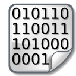

# Reference Implementation of Contextinformation Routing Networks in Go

Contextinformation Routing Network (CRN) is a communication framework enabling
an universal service to join matching contextinformation respectively its
communication partners.

The concept and the specifications are described in RFC documents:

 * [CRN Concepts](https://raw.githubusercontent.com/stefanhans/golang-contexting/master/RFC/CRN_Concepts.txt)
 (in large parts completed)

 * [CIP Specification](https://raw.githubusercontent.com/stefanhans/golang-contexting/master/RFC/CIP_Specification.txt)
 (in large parts completed)

 * [CIR Specification](https://raw.githubusercontent.com/stefanhans/golang-contexting/master/RFC/CIR_Specification.txt)
 (not yet mature)

These documents are still drafts and will be finalized, if the reference implementation will be.

---
The main components of CRNs are the following:

### Contextinformation (CI)

Contextinformation (CI) refers mainly to the known terms information and context.
Due to the lack of an useful clear distinction between the two, CI is defined
here as information within its described context, i.e. context becomes part of
CI by describing it.
Another aspect of CI is the accuracy with regard to possible matches with other
CI. All of these has to be converted into a general format, in which the actual
meaning is not relevant to find matching CI.

### Contextinformation Coding (CIC)

Contextinformation Coding (CIC)is the conversion of CI into a binary format,
and vice versa.  CIC means both, the conversion rules (CIC-Ruleset) for a
particular type of CI and a concrete piece of encoded CI.
Every CIC has an identifier, called CIC-Number.
A CIC-Ruleset and all its encoded CI are linked by this CIC-Number. Encoded CI
has the form of two parallel bit strings of equal length.  This pair
consists of CIC-Content, an instance of the CIC-Ruleset, and CI-Mask, which is
used to define the accuracy of the searched match.  Then it is sufficient for
a bitwise match of two pieces of CI, if both CIC-Contents are equal or both
CI-Masks mark them as non-relevant.

The calculation of such a match between two CIs uses the following function
resp. bitwise expression

    match(Offer, Request) = (NOT (Offer-Content XOR Request-Content)) OR (Offer-Mask AND Request-Mask)

Let me illustrate this with an example.
Offer and Request are two communication roles, and location is the type of CI.
Offer says "I'm available for any Request with matching location (CI) to contact me" and
Request says "I'm searching for any Offer with matching location (CI)".
Both have an exact information about their location and can define a
surrounding area where Offer is available respectively Request is searching.
CIC-Content, as the encoded location, together with CI-Mask defines the
surrounding area by marking bits of CIC-Content as true in any case concerning
the match.  Here the CI of Offer and Request are matching, if the location of
one is in the surrounding area of the other and vice versa.

### Contextinformation Packet (CIP)

Encoded CI is encapsulated in a datastructure named Contextinformation Packet (CIP).
A CIP is divided into three parts:

 * Header Data
 (static and dynamic)

 * Contextinformation
 (mainly dynamic)

 * Application Data
 (mainly dynamic)

All information which has to be transferred inside CRNs has to be encapsulated
within CIPs.

### Contextinformation Routing (CIR)

Contextinformation Routing (CIR) takes place in an overlay network built
normally on top of the TCP/IP layer. It is organized basically by using
CIC-Content as index. It is oriented towards known concepts of network routing,
peer-to-peer and others network principles and B-tree like datastructures.

Additionally it is committing to the four properties of reactive systems as described
in the [Reactive Manifesto](http://www.reactivemanifesto.org/):

---
### Reference Implementation in Go

The goal of the reference implementation in Go is an open, unlimited and reactive
peer-to-peer overlay network design for all binary encodable kind of contextinformation
to connect its participants accordingly.

The implementation guidelines, additionally to the idiomatic Go ones, are
the so-called SOLID principles - originally for object-oriented design, but adapted for Go
as [SOLID Go Design](https://dave.cheney.net/2016/08/20/solid-go-design):

 * **S**ingle responsibility principle
 * **O**pen / Closed Principle
 * **L**iskov Substitution Principle
 * **I**nterface Segregation Principle
 * **D**ependency Inversion Principle

### Backend Packages and API

The infrastructure, namely Contextinformation Packet (CIP) and Contextinformation Routing (CIR),
will be implemented in Go packages. The API for the Contextinformation Coding (CIC) and the applications
will be follow afterwards. Concerning simplicity and conciseness of the API the complete backend
shall be oriented towards the standard library of Go.

### Application Prototypes

The prototypes for application testing and demonstration will be a kind of the standard distributed applications - chats.
These chats will have an isomorphic code model and will be flexible concerning their Contextinformation Codings.

The following frontends are planned:

 * Command-Line (mainly for backend testing)
 * Browser ([GopherJS](https://github.com/gopherjs/gopherjs))
 * Android ([golang/mobile](https://github.com/golang/mobile))
 * iOS ([golang/mobile](https://github.com/golang/mobile))
 * Desktop ([GUI library](https://github.com/avelino/awesome-go#gui) still under investigation)

  
 

---

### Current Status

At the moment I'm

 * hoping to get CIR as topic for my thesis at the FernUniversität Hagen
 * trying to become a native Go speaker and to find a good design for the
 [backend packages](https://godoc.org/github.com/stefanhans/golang-contexting/ctx) and the API

---

**_"Don't take the first solution you've found, it's quite surely not the best."_** 
