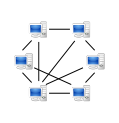

The RFC documents are neither finalized nor published.

### CRN Concepts

Mature draft

### CIP Specification

Related to the Qt implementation [Contexting Library](https://github.com/stefanhans/Contexting).
According to the reference implementation in Go, the rewriting has not started yet.

### CIR Specification

Neither up-to-date nor mature - more a kind of brainstorming yet