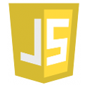

# Learning and Testing via Prototypes

### Application Prototypes

The prototypes for application testing and demonstration will be a kind of the standard distributed applications - chats.
These chats will have an isomorphic code model and will be flexible concerning their Contextinformation Codings.

### Command-Line (mainly for backend testing)

### Browser ([GopherJS](https://github.com/gopherjs/gopherjs))

### Android ([golang/mobile](https://github.com/golang/mobile))

### iOS ([golang/mobile](https://github.com/golang/mobile))

### Desktop ([GUI library](https://github.com/avelino/awesome-go#gui) still under investigation)

